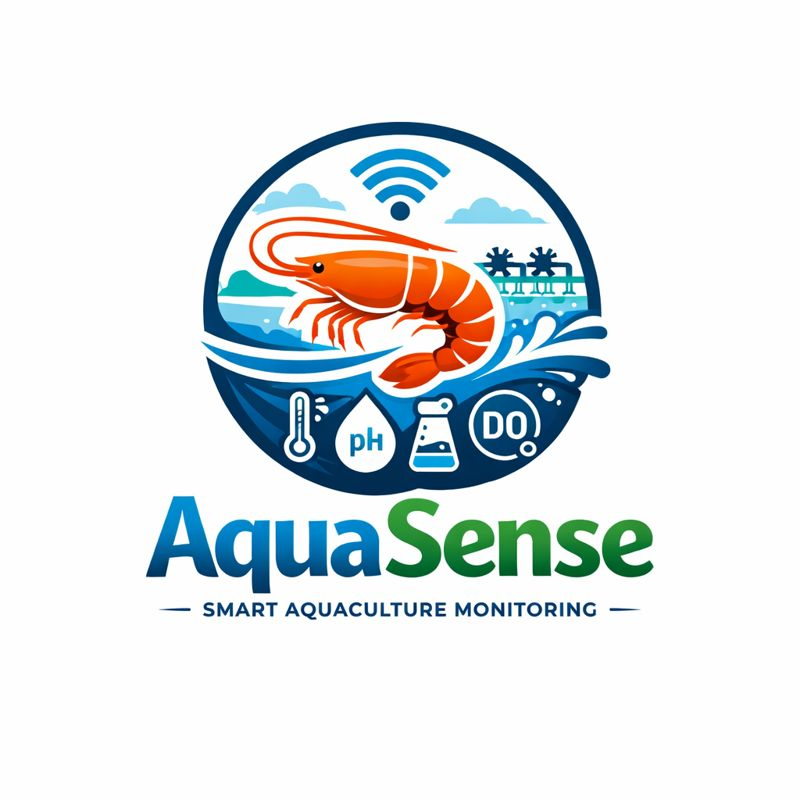
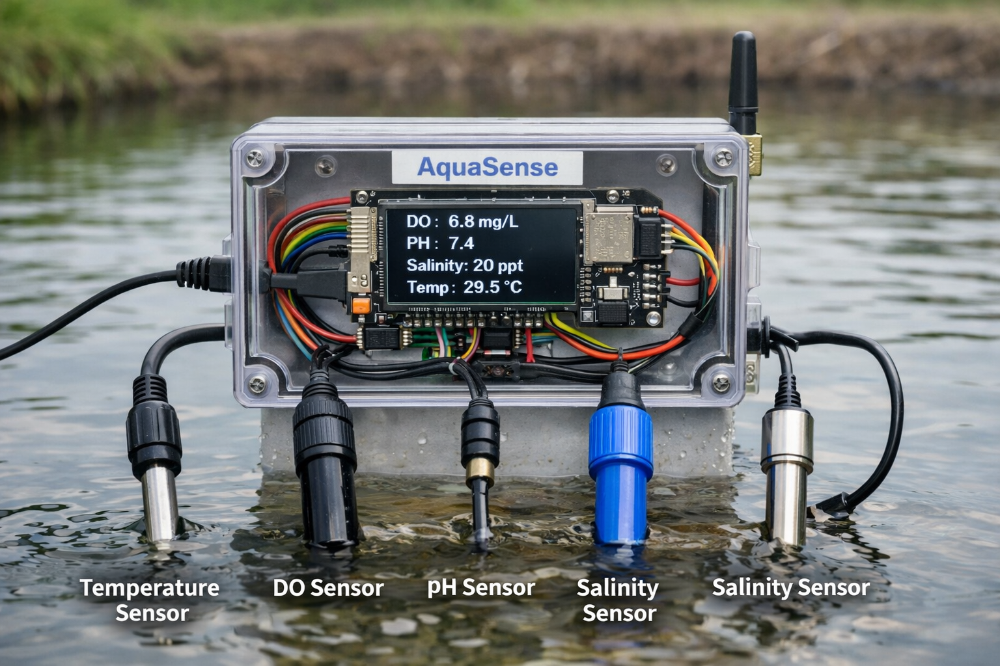

# AQUASENSE  
🌊 Smart Aquaculture Monitoring Platform  

AQUASENSE adalah **platform monitoring kualitas air tambak udang berbasis IoT** yang dirancang untuk membantu pembudidaya udang skala kecil dan menengah mengurangi risiko gagal panen melalui **pemantauan real-time dan peringatan dini**.

---

## Latar Belakang Masalah

Budidaya udang merupakan salah satu sektor pangan strategis dengan permintaan global yang terus meningkat. Namun, sektor ini juga memiliki tingkat risiko kegagalan yang tinggi.

Berbagai penelitian menunjukkan bahwa:
- **White Spot Syndrome Virus (WSSV)** dapat menyebabkan mortalitas udang hingga **90–100% dalam beberapa hari**.
- Faktor lingkungan seperti **oksigen terlarut (DO), pH, dan suhu air** berperan sebagai *stressor* yang meningkatkan kerentanan udang terhadap penyakit.
- Pembudidaya skala UMKM **tidak mampu memantau kualitas air selama 24 jam**, sehingga sering terlambat mengambil tindakan.

AQUASENSE dikembangkan untuk menjawab tantangan ini dengan pendekatan **preventif dan berbasis data**.

---

## Solusi: AQUASENSE

AQUASENSE menyediakan sistem yang:
- Memantau kualitas air tambak secara **real-time**
- Memberikan **peringatan dini (early warning)** saat kondisi air berada di luar batas aman
- Mengirim notifikasi langsung ke **WhatsApp pembudidaya**
- Dirancang **terjangkau dan mudah digunakan** oleh UMKM perikanan

> Fokus AQUASENSE bukan menghilangkan penyakit, tetapi **mengelola risiko lingkungan yang memperparah dampaknya**.

---

## Mockup Prototype Perangkat

